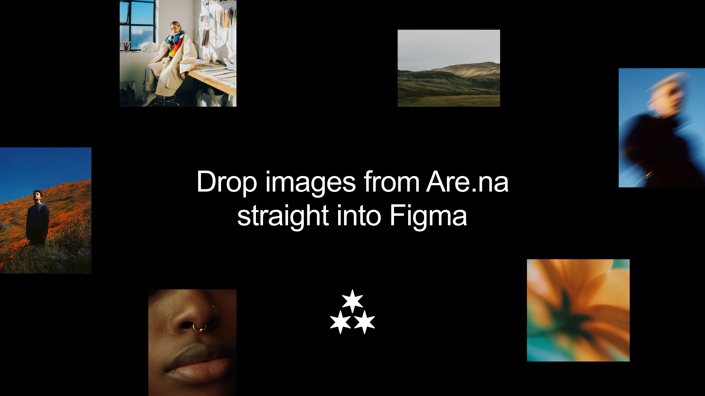

  

<h1 align="center">Asterism</h1>

  <strong>An Are.na image browser for Figma.</strong> 
  <em>Browse, collect, and moodboard from Are.na without leaving your canvas.</em>

  <a href="#install">Install</a> ·
  <a href="#features">Features</a> ·
  <a href="#usage">Usage</a> ·
  <a href="#release-notes">Release Notes</a>

---

Asterism connects Figma to Are.na. Search any public channel, browse its images in a grid, and place them directly onto your canvas — or generate a moodboard in one click.

No exporting. No downloading. No tab switching.

---

## Install

Asterism isn't on the Figma Community yet — install it locally in a few steps.

1. **[Download ZIP](https://github.com/jakedugard/asterism/archive/refs/heads/main.zip)** and unzip
2. Open the **Figma desktop app**
3. Go to **Plugins → Development → Import plugin from manifest...**
4. Select the `manifest.json` inside the unzipped folder

The plugin will appear under **Plugins → Development → Asterism**.

> **Note:** Local plugins only work in the Figma desktop app, not the browser.

---

## Features

### Browse
- Search Are.na channels by keyword with a live dropdown
- Paste a direct channel URL to load it instantly
- Infinite scroll through the image grid

### Place
- Click any image to place it on the Figma canvas at its correct aspect ratio
- Recently browsed channels saved automatically under **Recent**

### Saved channels
- Save any channel by URL or slug under the **Saved** tab
- Saved channels persist across sessions — click to reload, × to remove

### Surprise me
- Hit **Surprise me** from the Saved tab to generate a moodboard from your saved channels
- Randomly samples up to 5 channels, pulls images from a random page in each, and drops a 4×4 moodboard on canvas

### Find similar ★
- Hover any image in the grid for the star button
- Uses Are.na's co-occurrence graph to find other channels the image appears in
- Pulls related images from those channels and drops them as a 4×4 moodboard

### Moodboard frame
- Auto layout, 4-column horizontal wrap
- Frame height hugs content — no fixed sizing
- Images placed at correct aspect ratio using FIT scale mode

---

## Usage

1. Open Asterism from **Plugins → Development**
2. Search for a channel or paste an Are.na URL
3. Browse the grid — click any image to place it
4. Hover an image and hit ★ to generate a similar moodboard
5. Save channels under **Saved** and hit **Surprise me** for a random moodboard from your collection

---

## Why this exists

Are.na is one of the best places to collect visual references. Figma is where those references end up. The two apps don't talk to each other — so every mood board starts with a round trip of downloading, dragging, and resizing.

Asterism cuts that out.

---

## Release Notes

### v1.2 — Saved channels + Surprise me (2026-04-08)

- **Saved tab** — save any channel by URL or slug; persists across sessions
- **Surprise me** — generates a 4×4 moodboard by randomly sampling your saved channels
- **Find similar** — co-occurrence moodboard from any image in a channel
- Moodboard frames now use auto layout with hugged height
- Plugin name updated for clarity in the Figma development menu

### v1.0 — Initial release

- Search and browse public Are.na channels
- Place images onto the Figma canvas
- Recent channels panel with clear history
- Infinite scroll

---

## Built by

**Jake Dugard** · [jakedugard.com](https://jakedugard.com)
